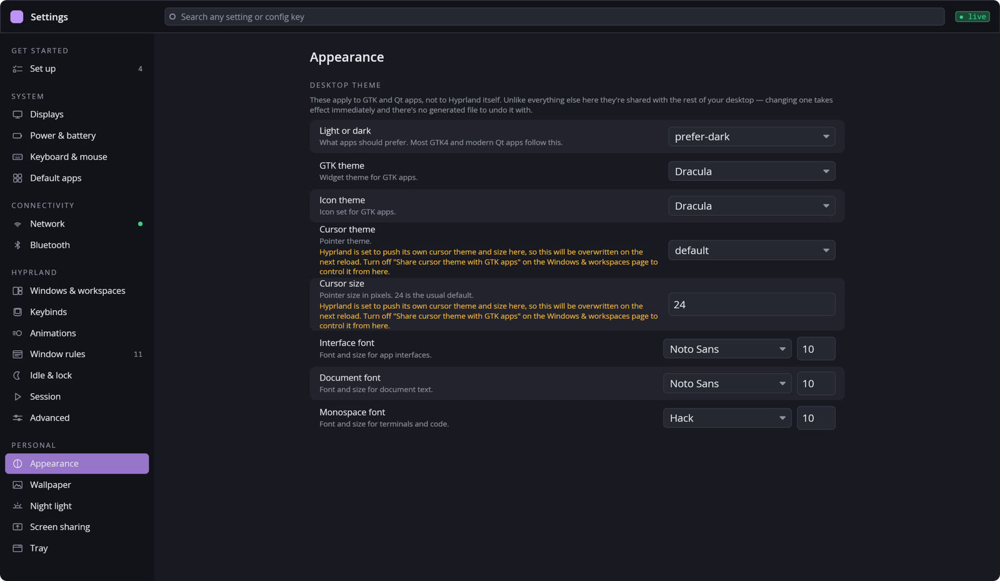
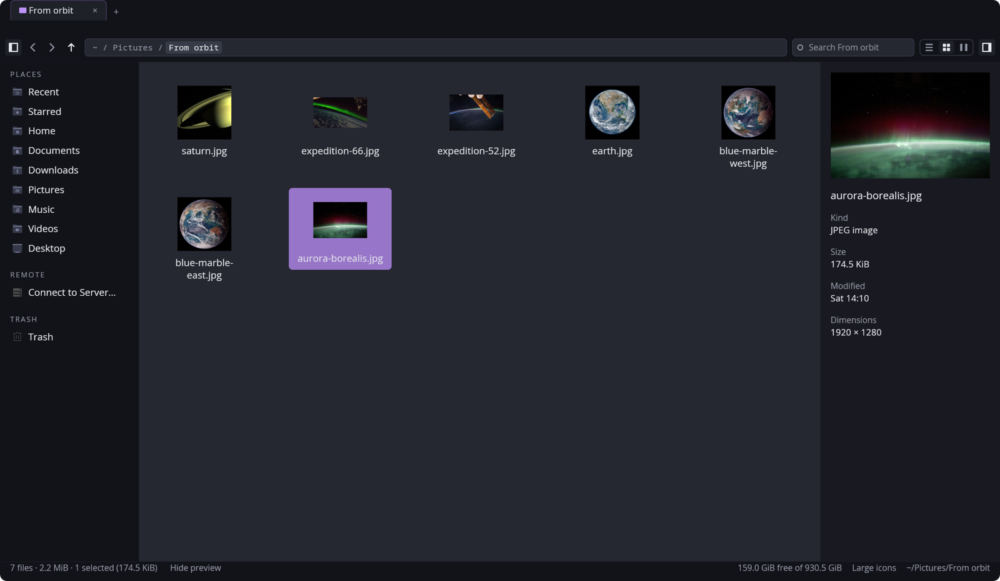
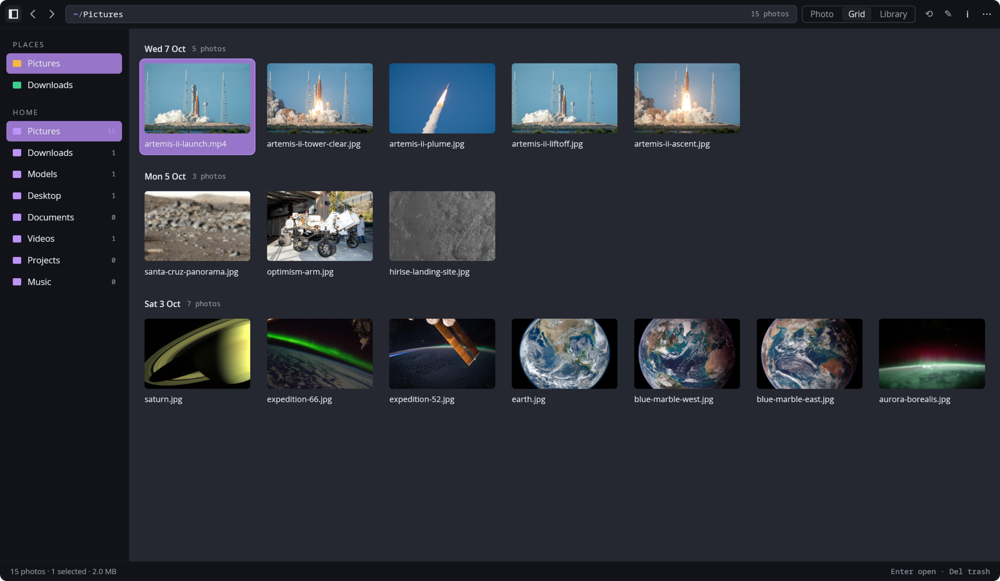
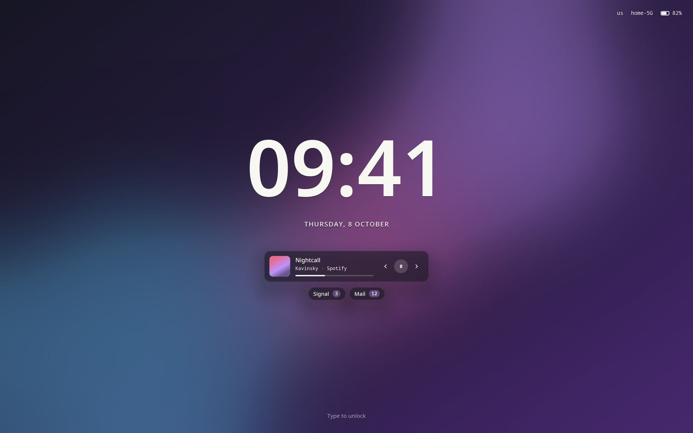
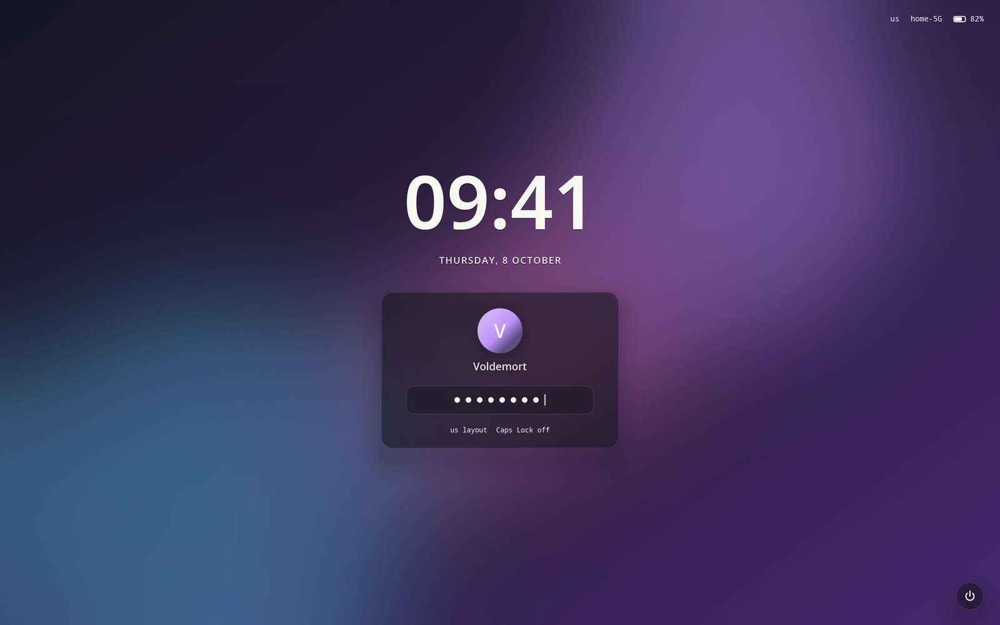
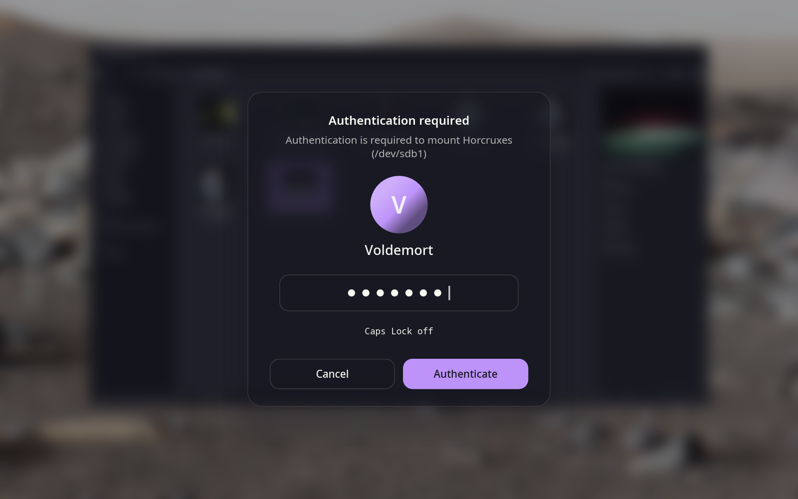
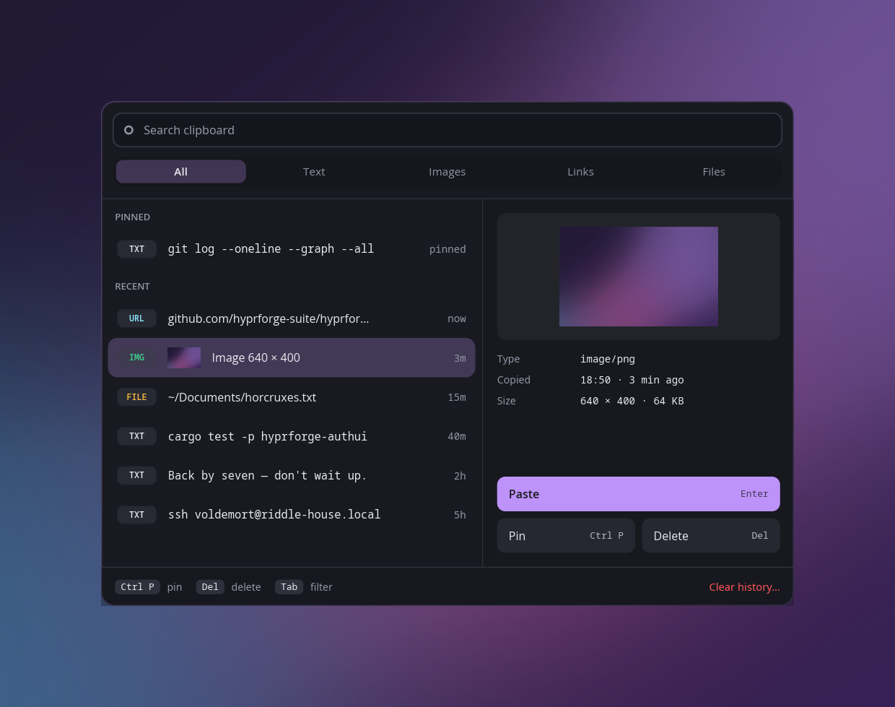
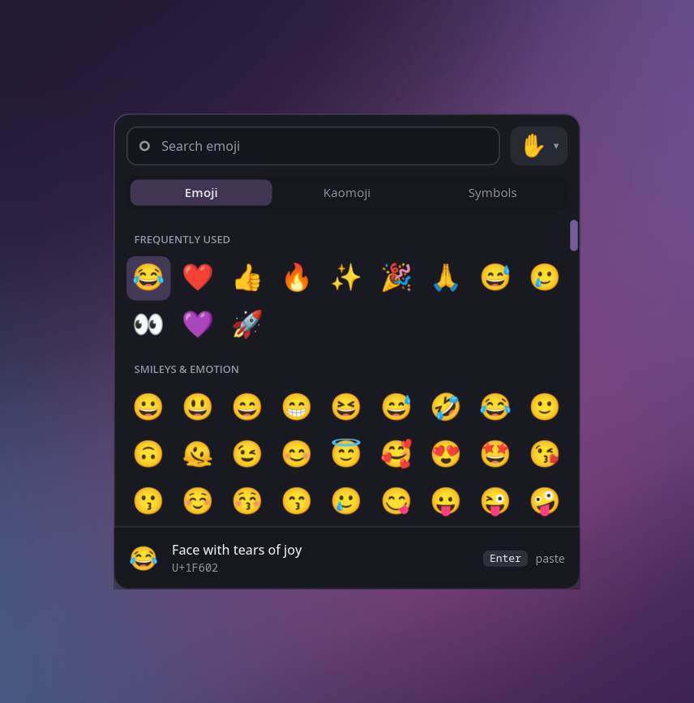
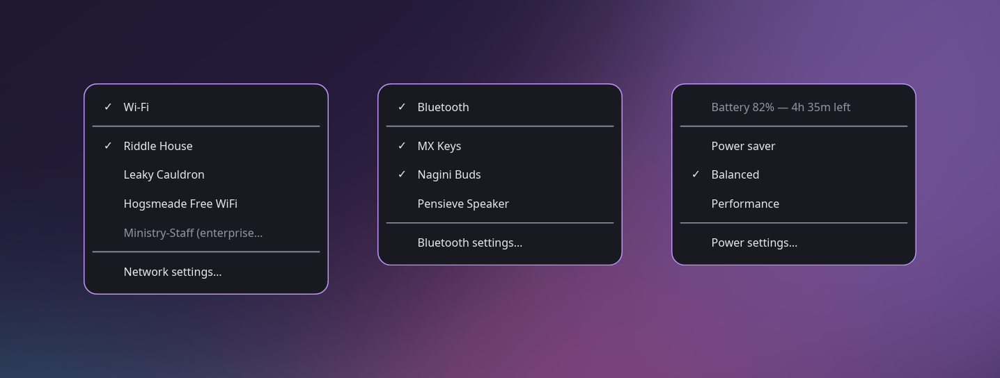
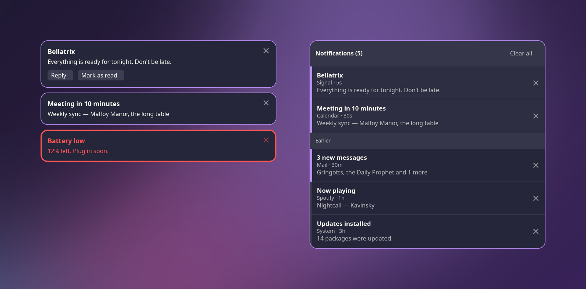

# Hyprforge

A Displays daemon, the Window Rules/Shortcuts/Input/Appearance config
libraries, a Settings GUI, a clipboard history, an emoji picker, a
StatusNotifierItem tray, Network/Bluetooth/power clients, a file manager,
a photo, video and 3D model viewer, and a shared lock screen and greeter
— all for Hyprland. See [`docs/design/vision.md`](docs/design/vision.md)
for the whole-suite plan, including what is not built yet, and
[hyprforge-suite.github.io/hyprforge](https://hyprforge-suite.github.io/hyprforge/)
for the website.

> Hyprforge is an independent project. It is not affiliated with or
> endorsed by hyprwm or the Hyprland project.

## Screenshots

The three apps — Settings, Files and Media:







The lock screen, idle and then with a password being typed, and the greeter
that shares its look:






And the same card again when an application needs administrator access —
the polkit agent, over the desktop dimmed and blurred:



The popups — clipboard history, the emoji picker, the tray's own menus and
notifications — share one look with it:









The photographs in these screenshots are NASA's, which are in the public domain.

## Requirements

- **Hyprland 0.55 or later, with a Lua config (`hyprland.lua`).** Hyprforge
  loads what it generates through `require()`, which only Lua configs have.
  It was built and measured against 0.56. With only a `hyprland.conf`, it
  says so and points at migrating; it never edits a `.conf`. See
  [`docs/config-integration.md`](docs/config-integration.md).
- **To build:** Rust, at the version `rust-toolchain.toml` pins (rustup
  installs it), plus the development files for `wayland`, `libxkbcommon`
  and `pam`. The packaging is Arch's; elsewhere, `./hyprforge --install`
  builds and installs from a checkout.
- **Optional, per feature:** NetworkManager, BlueZ, UPower,
  power-profiles-daemon, fprintd, UDisks2, gvfs, mpv, ffmpeg, greetd and
  fcitx5 each light up one part of the suite. A missing one is a message
  in that part, never a crash, and the PKGBUILD lists each as an optional
  dependency of the package that uses it.

## Thirteen repositories, one workspace

The suite lives in the [hyprforge-suite](https://github.com/hyprforge-suite)
GitHub organisation (`hyprforge` itself was already taken by an unrelated
project), and every repository in it is public. Twelve components have
repositories of their own, each with green CI, and each appears here as a
git submodule at `crates/<component>`; this repository is where the
libraries they share live, and the only place that says how the thirteen fit
together.

| Repository | What it is |
|---|---|
| [hyprforge-clipboard](https://github.com/hyprforge-suite/hyprforge-clipboard) | A Wayland clipboard history library over `wlr-data-control`/`ext-data-control`, plus `hyprforge-clipd`, the daemon that watches the compositor's clipboard and writes its history, and `hyprforge-clipmenu`, the popup that shows it and pastes what you pick. |
| [hyprforge-lock](https://github.com/hyprforge-suite/hyprforge-lock) | An `ext-session-lock-v1` lock screen for Hyprland: PAM and fingerprint unlock, a status line, media and notification counts, a power menu, and a look shared with the greeter. |
| [hyprforge-greet](https://github.com/hyprforge-suite/hyprforge-greet) | A greetd greeter for Hyprland, sharing its look and authentication conversation with the lock screen. |
| [hyprforge-tray](https://github.com/hyprforge-suite/hyprforge-tray) | A StatusNotifierItem tray library, plus `hyprforge-trayd`, the daemon that puts network (Wi-Fi and Ethernet), Bluetooth, keep-awake, night-light, battery/power-profile and display-layout icons in whatever bar is running, with right-click menus drawn by its own `hyprforge-traymenu` on Hyprland and served as `com.canonical.dbusmenu` for the bar to draw everywhere else. |
| [hyprforge-settings](https://github.com/hyprforge-suite/hyprforge-settings) | The Settings app: an iced GUI over Hyprland's config, appearance, displays, network, Bluetooth, shortcuts and more. |
| [hyprforge-displayd](https://github.com/hyprforge-suite/hyprforge-displayd) | A monitor-arrangement daemon: it watches `wlr-output-management`, recognises a set of displays it has seen before and applies the layout saved for it, plus `hyprforge-displayctl` to drive it from a script. |
| [hyprforge-emojimenu](https://github.com/hyprforge-suite/hyprforge-emojimenu) | An emoji picker: a layer-shell popup at the pointer with type-to-filter search over the full Unicode set, frequently used first, skin tones and a remembered default tone, plus kaomoji and symbols. |
| [hyprforge-files](https://github.com/hyprforge-suite/hyprforge-files) | A file manager: tabs, a sidebar, list, grid and column views with thumbnails, a preview pane, the freedesktop trash, copy, paste and drag with other applications, and zip/tar/7z archives browsed and edited in place. |
| [hyprforge-media](https://github.com/hyprforge-suite/hyprforge-media) | A photo, video and 3D model viewer: a folder browsed in the file manager's order, a date-grouped grid and library, EXIF and orientation done right, videos through libmpv, STL/3MF/OBJ models on the GPU, and a slideshow. |
| [hyprforge-notif](https://github.com/hyprforge-suite/hyprforge-notif) | A notification daemon, `notifd`, replacing dunst or mako: the full `org.freedesktop.Notifications` server, layer-shell toasts, a notification center with history, do-not-disturb, and `notifctl` to drive them. A cargo workspace of its own, on smol rather than tokio. |
| [hyprforge-procman](https://github.com/hyprforge-suite/hyprforge-procman) | A process manager with Task Manager as the floor: processes grouped by window, Performance, Startup, Users, Details and Services, through a polkit-checked root helper. `hyprforge-top` is atop's screen in a terminal, and a recorder keeps a root-only history of the whole machine, with network per process counted by eBPF. |
| [hyprforge-polkit](https://github.com/hyprforge-suite/hyprforge-polkit) | A polkit authentication agent: the administrator prompt, drawn as the lock screen's card over a dimmed and blurred desktop, relaying polkit's own PAM conversation — a password, or a fingerprint where the `polkit-1` stack offers one. |

Eleven of the twelve are meant to be installed on their own: clone
`hyprforge-clipboard` and you get a clipboard daemon and nothing else — no
Settings app, no tray, no Hyprland config machinery. `hyprforge-settings` is
the exception and its own README says so: it depends on eighteen other
Hyprforge crates, which makes it the hub rather than a small standalone thing.
"Every component runs alone, and is better together" in `CLAUDE.md` is the
rule this is built around; `docs/design/repo-plan.md` opens with the reasoning for why
repository identity and installable-alone are worth keeping as separate
questions, rather than restated here.

To work on the suite and its components together, clone with them:

```
git clone --recurse-submodules https://github.com/hyprforge-suite/hyprforge
# or, in a clone made without them:
git submodule update --init
```

If you only care about one component, clone its repository and
`cargo test`. How the libraries reach the components, and where a change
to one should be made, is in [`docs/architecture.md`](docs/architecture.md).

## Installing

Everything that lives outside this repository — binaries in
`/usr/local/bin`, the greeter's compositor config, the PAM stack, the
exported-look directory — is handled by `./hyprforge`:

```sh
./hyprforge --status                   # what is installed, and is it stale
./hyprforge --install --greeter        # install, or update in place
./hyprforge --install --all --dry-run  # show what that would do
./hyprforge --uninstall --lock --force-cleanup
```

Install and update are the same command: it builds, compares each file
against what is installed, copies only what differs, and then verifies
the copy landed. That last check is not ceremony — a stale binary in
`/usr/local/bin` looks exactly like a code change that did not work, and
`--status` is the fastest way to rule it out.

`--install` ends by running `hyprforge-settings --setup` when Settings is
installed. It wires the suite into the desktop: it enables the daemons'
user services, binds the popups, points hypridle's `lock_cmd` at the
lock screen, sets Files and Media as default applications, and sets up
the open/save dialog. It asks about each item. Under `--yes` it applies
each item's default, and under `--dry-run` it only lists what it would
do. It is the same code as the Settings app's **Set up** page, and it
records what it changed, so `hyprforge-settings --setup --undo` puts it
back. `--uninstall` offers that undo before it removes anything, and
`--status` shows each item's state.

It deliberately does **not** install `/etc/greetd/config.toml` or enable
`greetd`. That file decides which VT the machine logs in on, so it is the
one step that stays manual; see `crates/hyprforge-greet/INSTALL.md`.

From the Arch packages (`packaging/arch/PKGBUILD`), the four daemons —
displayd, trayd, clipd and notifd — are enabled for every user on
install, through systemd presets. notifd is the exception when dunst,
mako or swaync is installed: only one notification daemon can run, so
its package leaves that choice to the Set up page. The Settings package
points at the Set up page for the rest. Nothing in the user's own
config is written as root.

To build those packages from a checkout:

```sh
cd packaging/arch
makepkg -si
```

The PKGBUILD builds the checkout it sits in, so clone with
`--recurse-submodules` first.

## Build

```
cargo build --workspace --release
```

Binaries land in `target/release/`: `hyprforge-displayd`,
`hyprforge-displayctl`, `hyprforge-settings`, `hyprforge-files`,
`hyprforge-media`, `hyprforge-clipd`,
`hyprforge-clipmenu`, `hyprforge-emojimenu`, `hyprforge-trayd`,
`hyprforge-traymenu`, `hyprforge-mimetype`, `hyprforge-mimeopen`,
`hyprforge-lock`, `hyprforge-greet`.

## Checking everything works

```
./check.sh          # everything available on this machine
./check.sh --quick  # no compositor or daemons needed
```

Tier 1 — clippy, the unit and integration tests, and checks on the
manifests and the docs — runs anywhere. Every tier past it asks a real
system something (Hyprland, NetworkManager, BlueZ, UDisks2, crates.io and
more) and runs only when that system is there; a check that could not run
is reported in yellow rather than counted as a pass.
[`docs/testing.md`](docs/testing.md) has every step and why it exists.

## Documentation

- [`docs/architecture.md`](docs/architecture.md) — the workspace layout, its layers, and how the component repositories relate to this one
- [`docs/config-integration.md`](docs/config-integration.md) — where config lives, how `hyprland.lua` loads it, window rules, shortcuts, input, appearance, and importing hand-written config
- [`docs/displays.md`](docs/displays.md) — `hyprforge-displayd`: profiles, confirm/revert, scales as 120ths, the `monitors.lua` fallback, competing `hl.monitor()` rules, and the D-Bus API
- [`docs/lock-and-greeter.md`](docs/lock-and-greeter.md) — the lock screen and the greeter
- [`docs/testing.md`](docs/testing.md) — `check.sh` and its tiers
- [`docs/design/`](docs/design/) — the suite's [vision](docs/design/vision.md), the [repository plan](docs/design/repo-plan.md) and the [media viewer plan](docs/design/media-plan.md)
- [`site/`](site/) — the website, built by `tools/build-site.py`; a screenshot a page asks for is drawn from the PNG of that name in docs/images once it exists, and as a placeholder naming the file until then
- [`CLAUDE.md`](CLAUDE.md) — the working conventions, and the rules that came from being wrong

## Licence

MIT — see [`LICENSE`](LICENSE).
